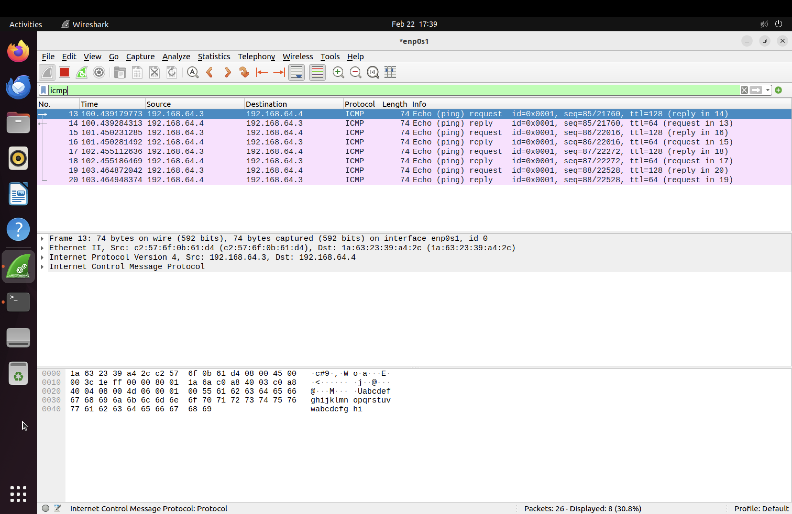
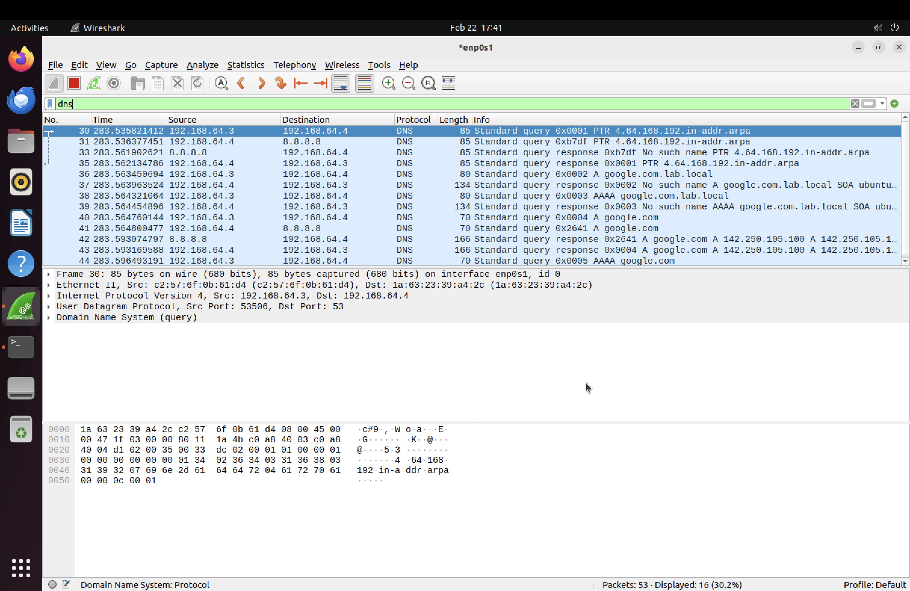

# Lab 3: Networking & Connectivity

## Objective
Practice core networking skills including IP configuration, DNS troubleshooting, connectivity diagnostics, and packet analysis in a virtualized environment.

## Tools Used
- Windows 11 ARM VM (client)
- Ubuntu 22.04 LTS VM (domain controller/DNS server)
- Wireshark (packet analysis)
- PowerShell networking commands

## Labs Completed

### 3.1 - Network Configuration Analysis
- Analyzed full network configuration using `ipconfig /all`
- Identified key settings: IP address, subnet mask, default gateway, DHCP status, DNS servers
- Confirmed domain membership and DNS pointing to domain controller (192.168.64.4)

### 3.2 - Connectivity Diagnostics
- **ping:** Tested connectivity to domain controller (0% packet loss, <1ms response)
- **nslookup:** Verified DNS resolution for both internal (lab.local) and external (google.com) names
- **tracert:** Traced route to google.com showing 24 hops through UTM gateway, home router, ISP (Charter), and Google's network
- **arp -a:** Viewed local network device table with IP-to-MAC address mappings

### 3.3 - DNS Forwarder Troubleshooting
- Discovered Windows client could reach internal resources but not external websites
- Diagnosed root cause: Samba DNS was not forwarding external queries
- Fixed by editing /etc/samba/smb.conf to set `dns forwarder = 8.8.8.8`
- Also corrected config file where forwarder was placed outside [global] section
- Verified fix: Windows client successfully resolved and pinged google.com

### 3.4 - Static IP Configuration
- Assigned static IP (192.168.64.10) using `New-NetIPAddress` in PowerShell
- Verified connectivity to domain controller from new static IP
- Reverted to DHCP using `Set-NetIPInterface -Dhcp Enabled`
- Re-configured DNS server after DHCP reset
- Demonstrated ability to switch between static and DHCP configurations

### 3.5 - ARP Table Analysis
- Used `arp -a` to view IP to MAC address mappings on local network
- Identified gateway (192.168.64.1), domain controller (192.168.64.4), and broadcast addresses
- Understood how ARP tables are used to detect IP conflicts

### 3.6 - Wireshark Packet Capture and Analysis
- Captured live network traffic on Ubuntu VM using Wireshark
- Filtered ICMP traffic to isolate ping packets between Windows client and domain controller
- Observed Echo request/reply pairs with matching MAC addresses from ARP table
- Filtered DNS traffic to observe full resolution chain:
  - Windows client queries domain controller
  - Domain controller forwards to 8.8.8.8 (Google DNS)
  - Response returns through domain controller to client
- Identified normal DNS behavior including domain suffix search attempts

## Troubleshooting
- **External DNS not resolving:** DNS forwarder in smb.conf was pointing to disabled systemd resolved (127.0.0.53). Changed to 8.8.8.8.
- **Config file formatting:** DNS forwarder line was appended outside [global] section. Used sed to fix placement.
- **resolv.conf lost on reboot:** Symlink to systemd-resolved was broken. Removed symlink and created static file.

## Screenshots

## Skills Demonstrated
- Network configuration analysis (ipconfig, ifconfig)
- Connectivity testing (ping, tracert, nslookup)
- DNS troubleshooting and forwarder configuration
- Static IP and DHCP configuration via PowerShell
- ARP table analysis for device identification
- Packet capture and protocol analysis with Wireshark
- Network traffic filtering and interpretation