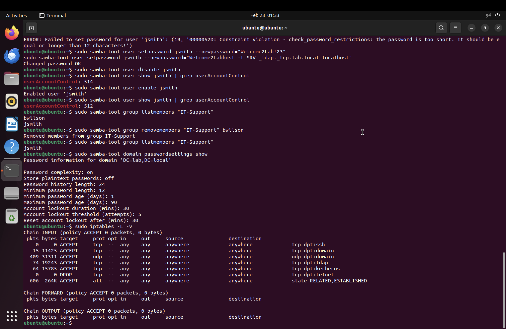
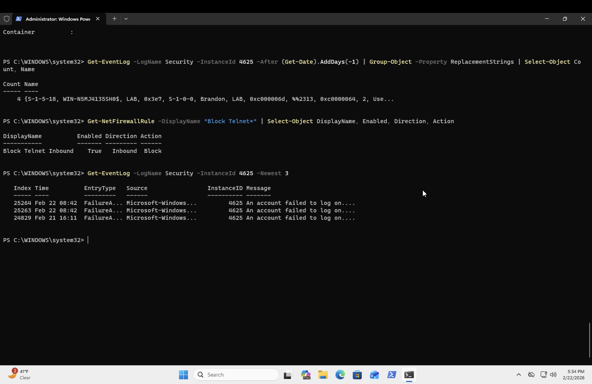

# Lab 4: Security & Endpoint Protection

## Objective
Configure firewalls on Windows and Linux, harden Active Directory password policies, analyze security event logs, and practice common security administration tasks.

## Tools Used
- Windows 11 ARM VM (endpoint security)
- Ubuntu 22.04 LTS VM (domain controller security)
- Windows Firewall (PowerShell)
- iptables (Linux firewall)
- Windows Security Event Logs

## Labs Completed

### 4.1 - Windows Firewall Configuration
- Reviewed all three firewall profiles (Domain, Private, Public) using `Get-NetFirewallProfile`
- Enabled logging for blocked and allowed connections on the Domain profile
- Created inbound firewall rule to block Telnet (port 23) — insecure protocol that sends passwords in plain text
- Verified rule was active and tested with `Test-NetConnection` confirming Telnet was blocked while ping still worked

### 4.2 - Linux Firewall Configuration (iptables)
- Reviewed default iptables rules (all chains empty with ACCEPT policy)
- Built a firewall configuration allowing only necessary services:
  - Port 22 (SSH) — remote server access
  - Port 53 TCP/UDP (DNS) — domain name resolution
  - Port 389 (LDAP) — Active Directory user lookups
  - Port 88 (Kerberos) — AD authentication
  - ESTABLISHED/RELATED connections — allows responses to outbound traffic
- Blocked Telnet (port 23) on Linux to match Windows hardening
- Observed real packet counts showing live AD traffic (DNS, LDAP, Kerberos)

### 4.3 - Password Policy Hardening
- Reviewed default domain password settings using `samba-tool domain passwordsettings show`
- Identified security gaps: minimum length only 7, account lockout threshold at 0 (unlimited attempts)
- Hardened password policy:
  - Minimum password length: 7 → 12 characters
  - Account lockout threshold: 0 → 5 failed attempts
  - Maximum password age: 42 → 90 days
  - Lockout duration: 30 minutes
- Verified policy enforcement: short password was rejected with constraint violation error

### 4.4 - Account Management and Security
- Reset user password using `samba-tool user setpassword` with a policy-compliant password
- Disabled user account (userAccountControl: 514) simulating employee departure
- Re-enabled user account (userAccountControl: 512) simulating employee return
- Removed user from security group to revoke access after role change

### 4.5 - Security Event Log Analysis
- Queried Windows Security event logs for successful logins (Event ID 4624) and failed logins (Event ID 4625)
- Analyzed detailed login event properties: logon type, account name, source address, failure reason
- Identified logon types: Type 2 (interactive), Type 3 (network), Type 5 (service)
- Found 4 failed login attempts with failure code 0xc0000064 (account does not exist)
- Grouped failed login events by account to detect brute force patterns

## Key Event IDs
- **4624** — Successful logon
- **4625** — Failed logon
- **4672** — Special privileges assigned (admin logon)
- **4799** — Security group membership enumerated
- **5379** — Credential Manager accessed

## Troubleshooting
- **Firewall log not capturing on ARM:** Windows firewall logging enabled but log file remained empty — known ARM limitation. Verified rules were working through direct connection testing instead.
- **Password policy enforcement:** Confirmed policy was active by attempting to set a non-compliant password and verifying the rejection error.

## Screenshots

## Skills Demonstrated
- Windows and Linux firewall configuration
- Security policy hardening (password complexity, lockout thresholds)
- Security event log analysis and investigation
- Account lifecycle management (create, disable, enable, password reset)
- Brute force detection techniques
- Principle of least privilege (blocking unnecessary ports)