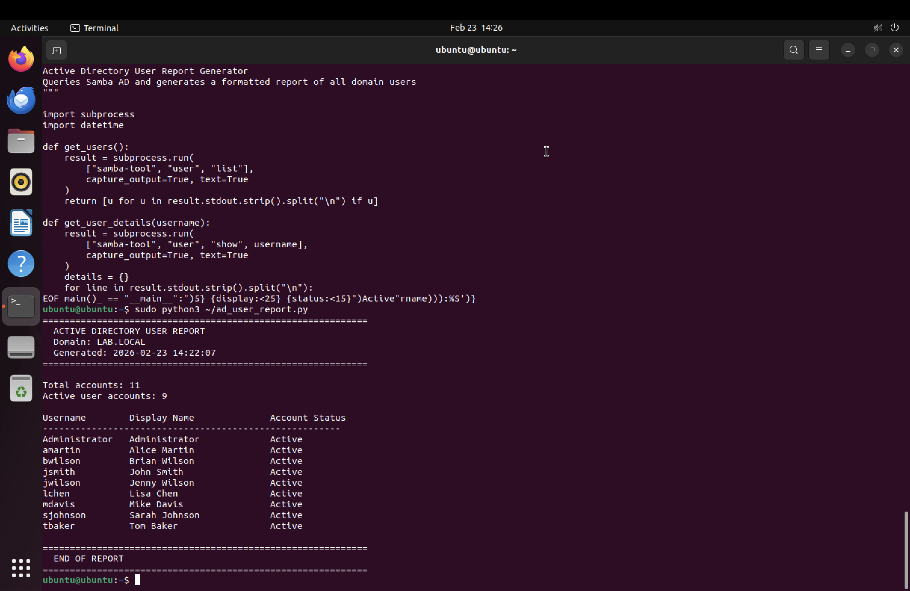

# Lab 5: Scripting & Automation

## Objective
Automate common IT administration tasks using PowerShell, Bash, and Python to demonstrate scripting skills for user management and reporting in an Active Directory environment.

## Tools Used
- PowerShell (Windows 11)
- Bash (Ubuntu Linux)
- Python 3 (Ubuntu Linux)
- Samba AD command-line tools

## Scripts Created

### PowerShell — CSV User Parser (Windows)
- Wrote a PowerShell script that reads a CSV file of new employees using `Import-Csv`
- Parsed each row to extract first name, last name, username, department, and password
- Generated formatted samba-tool commands for each user
- Demonstrated PowerShell loops, variable assignment, string interpolation, and CSV handling

### Bash — Bulk User Creation (Linux)
**Script:** [scripts/bulk_create_users.sh](scripts/bulk_create_users.sh)
- Reads employee data from a CSV file and creates Active Directory accounts in bulk
- Uses `tail` to skip the CSV header and `IFS` to parse comma-separated fields
- Creates each user via `samba-tool user create` with first name, last name, and password
- Handles errors gracefully — skips users that already exist instead of crashing
- Displays a summary of all domain users after completion
- Successfully created 5 users in seconds vs. manual creation one at a time

### Python — AD User Report Generator (Linux)
**Script:** [scripts/ad_user_report.py](scripts/ad_user_report.py)
- Queries Active Directory for all domain users using `subprocess` to call `samba-tool`
- Retrieves detailed user information including display name and account status
- Filters out built-in system accounts (krbtgt, Guest)
- Generates a formatted report with username, display name, and active/disabled status
- Includes timestamp, domain name, and account counts
- Demonstrates Python functions, list comprehensions, string formatting, and dictionary parsing

### Sample Data
**CSV:** [scripts/new_users.csv](scripts/new_users.csv)
- Template CSV file with 5 sample employees across IT and HR departments
- Format matches what HR would typically provide for new hire onboarding

## Real-World Application
- **Bulk user creation:** When a company hires 50 new employees, IT doesn't create accounts one by one. HR sends a spreadsheet and IT runs a script to create all accounts at once.
- **User reports:** Managers regularly request lists of active accounts for audits, compliance, or access reviews. A script generates this in seconds instead of manually checking each account.
- **Cross-platform scripting:** Most companies use both Windows and Linux. Being able to script in PowerShell, Bash, AND Python covers all environments.

## Screenshots

## Skills Demonstrated
- PowerShell scripting (CSV parsing, loops, string formatting)
- Bash scripting (file I/O, conditional logic, error handling)
- Python scripting (subprocess, functions, list comprehensions, string formatting)
- Automation of Active Directory user management
- Cross-platform scripting (Windows and Linux)